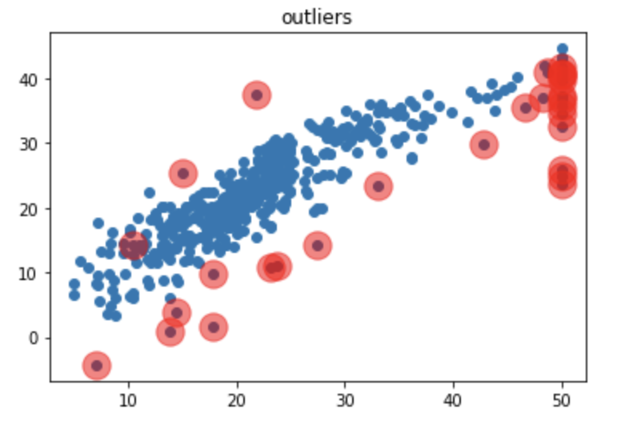
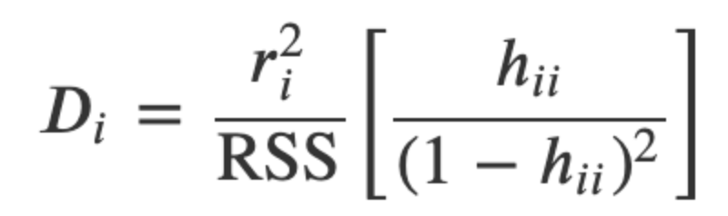
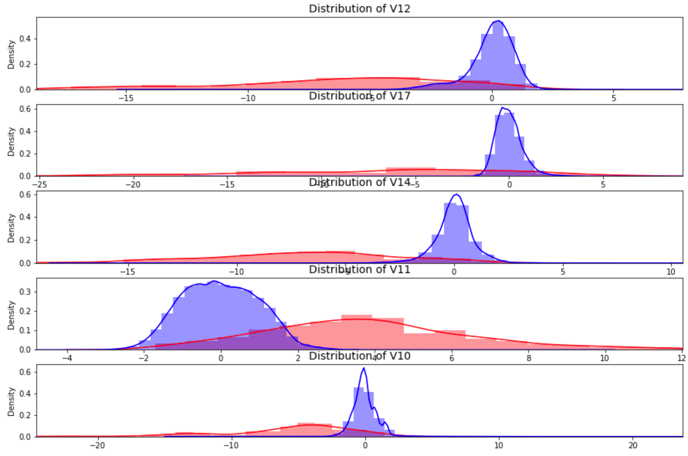
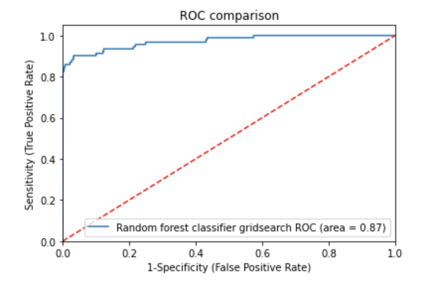

# Anomalies

 
 

  

### 1. Anomaly detection and visualization
[Jupyter notebook](Boston%20housing%20outliers.ipynb)

    
### 2. Irregularity (card fraud) detection
[Jupyter notebook](credit%20card%20fraud%20detection%20v2.ipynb)

